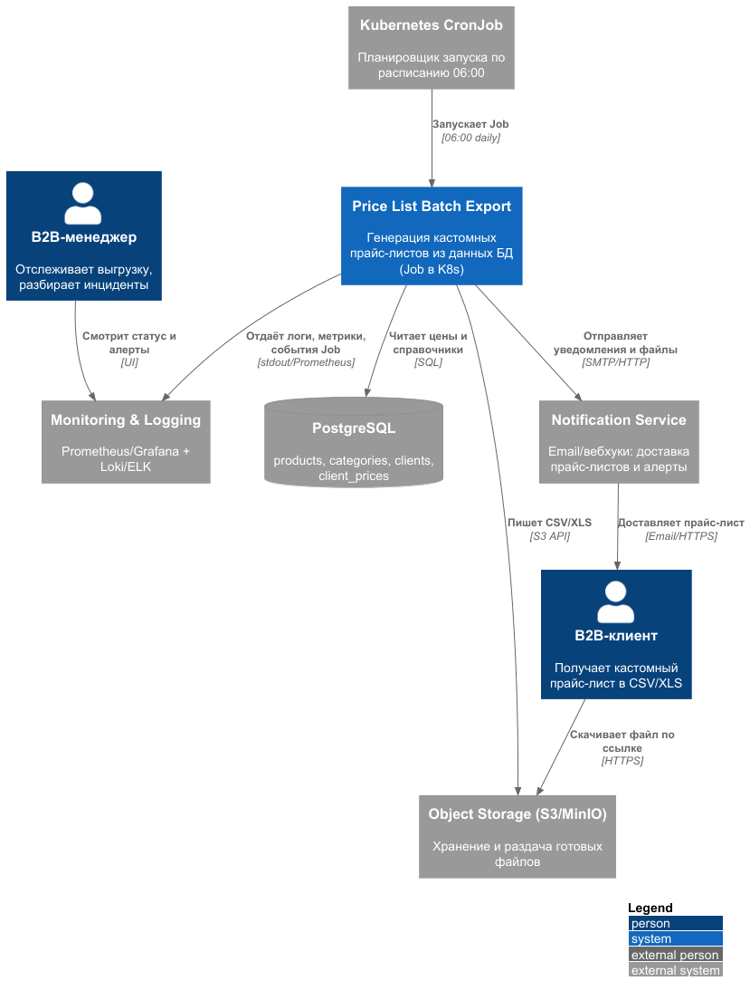

# Дизайн модуля пакетной обработки данных

## Контекст и требования

Каждое утро ровно в 06:00 онлайн-магазину нужно формировать кастомные прайс-листы
(CSV/XLS) для B2B-клиентов на основе актуальных данных в БД. Дополнительной логики
обработки данных не требуется.

Исходные данные (PostgreSQL):

| Таблица | Объём | Назначение |
|---|---|---|
| `products` | ~5 000–10 000 | Товары |
| `categories` | ~50–200 | Категории товаров |
| `clients` | ~100–500 | B2B-клиенты |
| `client_prices` | ~10 000–20 000 | Индивидуальные цены клиента на товар |

Результат - по одному файлу на клиента, суммарно 5 000–10 000 строк за прогон.
Инфраструктура - микросервисы в облаке (Kubernetes).

## Сравнительный анализ технологических решений

| Критерий | Spring Batch | Apache Airflow | K8s Job | Spark |
|---|---|---|---|---|
| **Наличие конфигурации CRON-расписания** | ⚠️ Нет "из коробки": `@Scheduled`, Quartz или внешний триггер (тот же K8s CronJob) | ✅ Первоклассная функция: `schedule`/cron-выражение в DAG | ✅ Нативный `CronJob` (поле `spec.schedule`, cron-формат), TZ | ❌ Нет планировщика: нужен внешний оркестратор (Airflow/CronJob) |
| **Сложность реализации логики по обработке данных** | ⚠️ Средняя: много boilerplate Job/Step/Reader/Processor/Writer, но ETL-примитивы готовы | ⚠️ Средняя: логика на Python/TaskFlow, join и выгрузку пишем сами | ✅ **Низкая**: обычный контейнер с одним SQL-join и записью файла | ❌ Средняя/высокая: мощный API, но оверхед на сессию, память, кластер |
| **Ресурсоёмкость решения (количество потребляемых ресурсов)** | ⚠️ Низкая/средняя: JVM-процесс в режиме one-shot | ❌ Высокая: webserver + scheduler + workers + metadata DB + Redis постоянно | ✅ **Очень низкая**: один pod на время запуска, затем освобождение (scale-to-zero) | ❌ Высокая: driver + executors, память/CPU избыточны для 10k строк |
| **Масштабируемость решения под нагрузкой и сложность реализации** | ❌ Средняя масштабируемость, высокая сложность (partitioning/remote chunking) | ⚠️ Высокая масштабируемость, высокая сложность настройки executor'ов | ✅ **Хорошая и простая**: параллельные Job/pod на клиента, `parallelism`, лёгкий рост | ❌ Максимальная масштабируемость, но высокая сложность и явная избыточность |
| **Сложность развёртывания в облаке и интеграция с имеющейся микросервисной  архитектурой** | ⚠️ Средняя: образ + Job-манифест; естественно для Java-стека, но нужен внешний триггер | ❌ Высокая: отдельный кластер Airflow (Helm, БД, секреты) - новый крупный компонент | ✅ **Низкая**: нативный ресурс K8s, ложится на текущий CD/мониторинг микросервисов | ❌ Высокая: Spark Operator/кластер, отдельная инфраструктура |
| **Удобство интеграции с системами логирования и мониторинга** | ⚠️ Хорошая при наличии APM/Micrometer | ⚠️ Хорошая "из коробки" (UI, метрики, логи), но отдельный контур наблюдаемости | ✅ **Хорошая и нативная**: `logs`/`events` pod'ов + Prometheus/Grafana; нужны алерты на статус Job | ⚠️ Средняя/хорошая, но отдельный Spark UI/стек |

## Вывод и обоснование выбора

Выбранное решение - Kubernetes CronJob, запускающий одноразовый Job (pod) с экспортёром.

Почему именно оно:

1. **Задача маленькая и тривиальная по логике.** 5 000–10 000 строк - это один SQL-join
   и потоковая запись CSV/XLS. Нет тяжёлых преобразований, нет потребности в
   распределённых вычислениях.
2. **Планировщик уже есть и родной.** K8s CronJob закрывает требование "каждое утро в
   06:00" нативно (`schedule: "0 6 * * *"` + `timeZone`), без внешнего компонента.
3. **Минимальная ресурсоёмкость.** Job создаёт pod на время выгрузки и освобождает
   ресурсы; `ttlSecondsAfterFinished` чистит pod.
4. **Идеальная интеграция с микросервисной архитектурой.** Это стандартный ресурс того
   же кластера: тот же CI/CD, те же Secrets/RBAC, тот же стек мониторинга. Новых
   крупных систем не появляется.
5. **Простая и дешёвая масштабируемость.** При росте объёма - `parallelism`,
   шардирование клиентов по pod'ам, увеличение `resources`. Без смены технологии.
6. **Наблюдаемость нативно.** Логи - через `kubectl logs`/Loki, статусы и метрики Job -
   через Prometheus (`kube_job_status_failed`, `kube_job_status_succeeded`) и алерты.

Почему не выбраны альтернативные решения:

- **Apache Airflow** - избыточен: ради одной простой ночной задачи поднимается постоянная
  инфраструктура (scheduler, workers, metadata DB). Airflow оправдан, когда есть
  много разнородных DAG'ов и зависимостей между системами - здесь этого нет.
- **Spark** - сильно избыточен по ресурсам и сложности: драйвер и исполнители ради join
  десятков тысяч строк. Даёт масштабируемость, которая не нужна и дорого стоит.
- **Spring Batch** - хороший вариант, если стек магазина преимущественно Java/Spring:
  его можно использовать *внутри* контейнера Job'а. Но как "верхнеуровневый" механизм он
  проигрывает: нет cron "из коробки", требуется внешний триггер и больше boilerplate.

K8s CronJob - оптимальный баланс "функциональность / ресурсы / сложность / интеграция" для данной задачи.

## C4-диаграмма контекста To Be 

## Как будет работать решение

1. **Триггер.** `CronJob` по расписанию `0 6 * * *` (TZ магазина) создаёт Job → pod с
   контейнером-экспортёром.
2. **Чтение.** Экспортёр подключается к PostgreSQL (read-only пользователь, TLS) и
   выполняет выборку данных.
3. **Формирование прайс-листов.** Данные группируются по клиенту, формируется файл
   (CSV и/или XLS) на каждого B2B-клиента. Запись - потоковая/батчами, без загрузки
   всего набора в память.
4. **Публикация.** Файлы выгружаются в Object Storage.
5. **Доставка.** Notification Service рассылает клиентам ссылки (или вложения) и
   уведомляет менеджеров о завершении/ошибках.
6. **Наблюдаемость.** Экспортёр пишет структурированные логи в stdout (→ Loki/ELK) и
   метрики (→ Prometheus). Состояние Job (`kube_job_status_*`) и алерты - в Grafana/Alertmanager.
7. **Надёжность.** `backoffLimit` даёт автоматические повторы; `activeDeadlineSeconds`
   ограничивает зависания; `concurrencyPolicy: Forbid` не допускает наложений;
   идемпотентность обеспечивается ключом запуска (дата) - повторный прогон перезаписывает
   файлы того же дня.
8. **Освобождение ресурсов.** После завершения pod удаляется
   (`ttlSecondsAfterFinished`), ресурсы возвращаются кластеру.

## 6. Риски и допущения

- **Согласованность чтения.** Для стабильного снимка используется транзакция
  `REPEATABLE READ` (или `pg_dump`-подобный snapshot), чтобы прайс-лист был консистентен.
- **Секреты.** Учётные данные БД - только через Secret/External Secrets, не в образе.
- **Память при XLS.** Формат XLS требует буферизации; при риске - использовать XLSX
  (streaming writer) или ограничивать размер файла на клиента.
- **Часовые пояса.** Расписание задаётся с явным `timeZone`, чтобы "06:00" совпадало с
  локальным временем магазина.
- **Рост объёма.** При значительном росте строк решение масштабируется через
  `parallelism`/шардирование по клиентам.